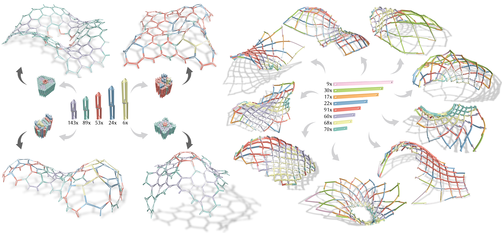

  <h1 align="center"><a href="https://go.epfl.ch/kop">Computational Design of a Kit of Parts for Bending-Active Structures</a></h1>

  

    To be presented at <a href="https://asia.siggraph.org/2024/">SIGGRAPH Asia 2024</a>.
     
    <a href="https://people.epfl.ch/quentin.becker?lang=en"><strong>Quentin Becker*</strong></a>
    ·
    <a href="https://udaykusupati.github.io"><strong>Uday Kusupati*</strong></a>
    ·
    <a href="https://people.epfl.ch/seiichi.suzuki?lang=en"><strong>Seiichi Suzuki</strong></a> 
    ·
    <a href="https://people.epfl.ch/mark.pauly?lang=en"><strong>Mark Pauly</strong></a>
     
    (*joint first author)
  

  

    
    
  

## About

This repository contains the source code and data for the paper Computational Design of a Kit of Parts for Bending-Active Structures.
The paper and code will be released soon, stay tuned!